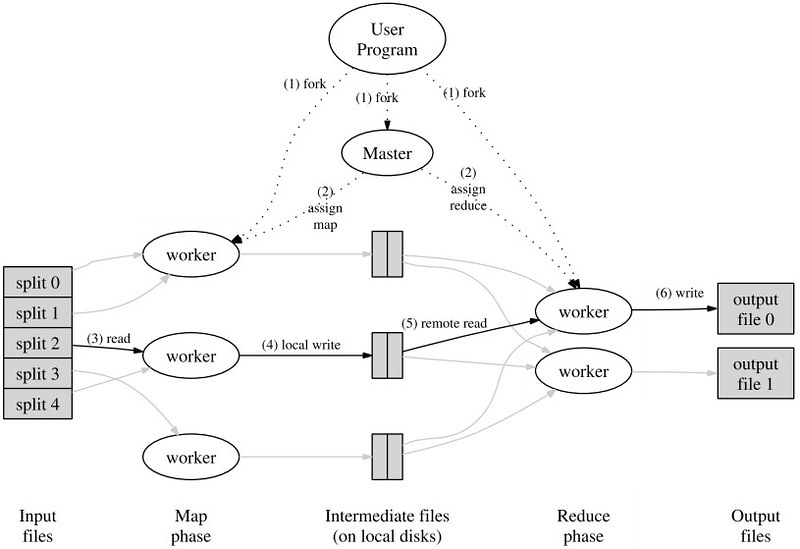

# MapReduce
A simple implementation of MapReduce distributed system and programming model.

## Introduction

MapReduce is a programming model and distributed system devised by Google in the early 2000s to do parallel large scale computation of large data sets.

A large input is partitioned into multiple input splits that are sent into worker machines containing the *map* function. The map function reads the input and each input entry is associated with a unique key.

All (key, entry) data are saved locally as *intermediate data* and sent over in the network to worker machines containing the *reduce* function. Entries with the same key are usually combined in the reduce function.

An example of **count of URL access frequency** from the MapReduce paper:
> *The map function processes logs of web page requests and outputs ⟨URL, 1⟩. The reduce function adds together all values for the same URL and emits a ⟨URL, total count⟩ pair.*

## References
- [MapReduce Paper](https://research.google/pubs/pub62/)
- [MapReduce on Wikipedia](https://en.wikipedia.org/wiki/MapReduce)

## Checklist
User Program
- [x] Input Split
- [ ] Run Workers Locally
- [ ] Tasks Progress Tracking
- [ ] Wake Up from Master
- [ ] Input Split with Custom File Format Reader

Master Program
- [x] Workers Status Periodical Update
- [x] Map Tasks Execution
- [ ] Reduce Tasks Execution
- [ ] User Program Wake Up

Worker Program
- [ ] Map
- [ ] Reduce
- [ ] Task Abortion on Master Failure

Distributed File Storage Use
- [ ] Run Workers Remotelly (Linux)
- [ ] Modify Program to use distributed storage instead of local storage